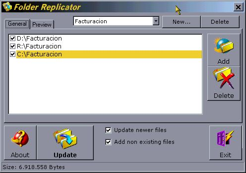



## Folder Replicator

### Description

Replicate folders with just a button
 
### More Info
 
It shows how to manage the file system functions in the Windows API

complete code

             |
---                |---
**Submitted On**   |2000-12-07 23:04:44
**By**             |[Jose Falugue](https://github.com/Planet-Source-Code/PSCIndex/blob/master/ByAuthor/jose-falugue.md)
**Level**          |Intermediate
**User Rating**    |4.4 (22 globes from 5 users)
**Compatibility**  |VB 6\.0
**Category**       |[Files/ File Controls/ Input/ Output](https://github.com/Planet-Source-Code/PSCIndex/blob/master/ByCategory/files-file-controls-input-output__1-3.md)
**World**          |[Visual Basic](https://github.com/Planet-Source-Code/PSCIndex/blob/master/ByWorld/visual-basic.md)
**Archive File**   |[CODE\_UPLOAD124511272000\.zip](https://github.com/Planet-Source-Code/jose-falugue-folder-replicator__1-13417/archive/master.zip)

